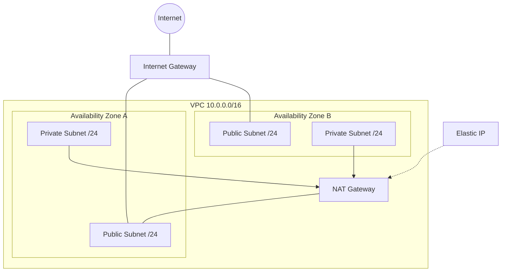

import basicNetworking from '!!raw-loader!@site/../cdk-playground/stacks/basic-networking.ts';
import CodeBlock from '@theme/CodeBlock';

# Basic Networking

In this lesson we will be going through the standard networking architecture. Big companies will build out much larger networking architectures featuring transitive peering, centrellazed ingress and egress, firewalls and much more; it might seem difficult to reconcile this with the simple architecture that you implement today. But whether you're working at this scale or a much smaller what you learn from the standard vpc architecture will serve as a model for how you can understand networking throughout all of AWS.

## Theory

The basic aws network architecture that every good cloud inclined platform engineer should know and the one you'll deploy right now looks like this:



Now let's go through the important components.

### VPC

A **Virtual Private Cloud** is your own isolated section of the AWS network. It is defined by a CIDR block (a range of private IP addresses, e.g. `10.0.0.0/16`) from which every resource inside draws its IP. Nothing inside a VPC is reachable from the internet unless you explicitly wire up a path, which is what the rest of these components do.

### Subnets

A VPC's address range is sliced into **subnets**, each living in a single **Availability Zone** (a physically separate datacentre). Spreading subnets across AZs — `maxAzs: 2` in the practical — is how you survive the failure of one datacentre. A subnet is **public** or **private** depending only on whether its route table can reach the internet directly.

### Internet Gateways

An **Internet Gateway (IGW)** is the door between your VPC and the public internet. Attaching one and routing a subnet's traffic through it is exactly what makes that subnet "public". There is one IGW per VPC and it scales automatically.

### NAT Gateways

Resources in private subnets often still need *outbound* internet access (to pull packages, call APIs) without being directly reachable *inbound*. A **NAT Gateway** sits in a public subnet and forwards that outbound traffic on their behalf. This is the role of `PRIVATE_WITH_EGRESS` in the practical. NAT Gateways cost money per hour and per GB, which is why the practical uses just `natGateways: 1` rather than one per AZ.

### Elastic IPs

A NAT Gateway needs a stable public IP to present to the internet. An **Elastic IP** is a fixed public IPv4 address you allocate to your account and attach to a resource — here, the NAT Gateway. Because it does not change, you can safely allow-list it on external systems.

### Route Tables

A **route table** is the set of rules that decides where a subnet's traffic goes. "Public" vs "private" comes down to this: a public subnet has a route sending `0.0.0.0/0` (everything) to the IGW, while a private subnet sends `0.0.0.0/0` to the NAT Gateway. The CDK `Vpc` construct creates and wires these for you automatically based on each subnet's type.

### Security Groups

A **security group** is a stateful firewall attached to a resource (like an EC2 instance). "Stateful" means if you allow traffic in, the reply is automatically allowed back out. They default to denying all inbound and allowing all outbound, and you open specific ports as needed.

### ACLs

A **Network ACL** is a stateless firewall that operates at the *subnet* boundary, evaluating every packet entering or leaving the subnet. Being stateless, you must define both the inbound and outbound rules explicitly. Most setups leave the default (allow-all) ACL in place and rely on security groups, treating ACLs as a coarse secondary layer.

## Practical
Head on over to the cdk playground.
```bash
cd packages/cdk-playground
```

Either create or modify your existing `index.ts` to deploy the BasicNetworkingStack. This should look something like:
```typescript
import { App } from "aws-cdk-lib";
import { BasicNetworkingStack } from "./stacks/basic-networking";

const app = new App()
new BasicNetworkingStack(app, 'basic-networking')
```

Once your ready with some active AWS credentials deploy the stack:
```bash
npx cdk deploy
```

### Experiment

To get little more stuck in we need to head over to `stacks/basic-networking.ts`.

<CodeBlock language="typescript">{basicNetworking}</CodeBlock>

Here you can see the resources/constructs we are creating, really we could get away with just the vpc construct but it's good to know the IP address that the resources in the VPC will use as we'll see in later lessons. If you've ever had to create a VPC yourself out of the raw components maybe take a second to appreciate the abstraction. In the configured properties of which there are many more of you get a feel for some of the most important questions we need to ask when designing a network:
 - How many availability zones do we need?
 - How will we handle egress?
 - How should the subnets be able to communicate internally and externally?
 - How big is this networking going to get?

Some things to try:
- Add another Subnet
- Implement a custom route
- Set a Subnets ACL
- Scale out and in
